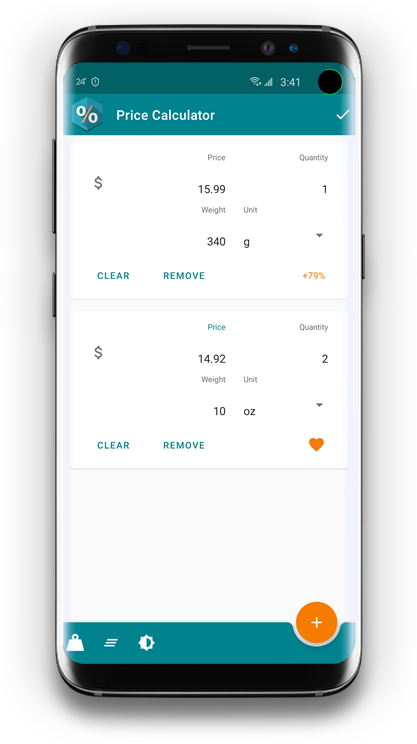
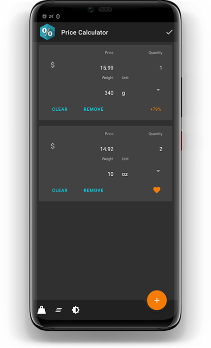
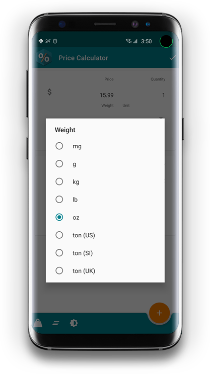
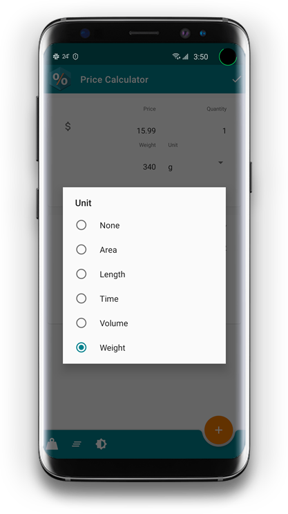

Unit Pricing Tool
=================

| Category      | Measurement                                                                                                                                                                                                                                                                                                                                                                                                                                                                                                                                                                       |
|---------------|-----------------------------------------------------------------------------------------------------------------------------------------------------------------------------------------------------------------------------------------------------------------------------------------------------------------------------------------------------------------------------------------------------------------------------------------------------------------------------------------------------------------------------------------------------------------------------------|
| Pipeline      |                                                                                                                                                                                                                                                                                                                                                                                                                          |
| Quality       |    |
| Coverage      |                                           |
| Ratings       |    |
| Security      |                                                                                                                                                                                                 |
| Miscellaneous |                                                            |

The forgotten shopping tool - using unit pricing is the [best](http://eprints.qut.edu.au/96291/) way for shoppers to save money on grocery shopping!

 

 

## Features
* Identify the cheapest item
* Show percentage difference for all items
* Supported unit types: volume, weight, length, area, time
* Automatic unit conversion
* Support dark mode

## Supported units
| Type   | Unit                                                             |
|--------|------------------------------------------------------------------|
| Weight | milligram, gram, kilogram, pound, ounce, tonne                   |
| Volume | millilitre, litre, ounce, gallon                                 |
| Length | millimetre, centimetre, metre, kilometre, inch, foot, yard, mile |
| Time   | minute, hour, day, week, month, year                             |
| Area   | sq. metre, sq. kilometre, sq. inch, sq. foot, sq. yard, sq. mile |

## Requirements
This app supports Android 4.4 Jelly Bean (API 19) or later.

## Acknowledgements
This app is made with the support of open source projects:

* [RxJava](https://github.com/ReactiveX/RxJava)
* [RxAndroid](https://github.com/ReactiveX/RxAndroid)
* [Dagger 2](https://google.github.io/dagger)
* [Espresso](https://google.github.io/android-testing-support-library)
* [JUnit 4](https://github.com/junit-team/junit4)
* [Robolectric](http://robolectric.org)
* [LeakCanary](https://github.com/square/leakcanary)
* [Dexcount Gradle Plugin](https://github.com/KeepSafe/dexcount-gradle-plugin)

… and closed source services:

* [CircleCI](https://circleci.com)
* [SonarCloud](https://sonarcloud.io)
* [Firebase Crashlytics](https://firebase.google.com/docs/crashlytics)
